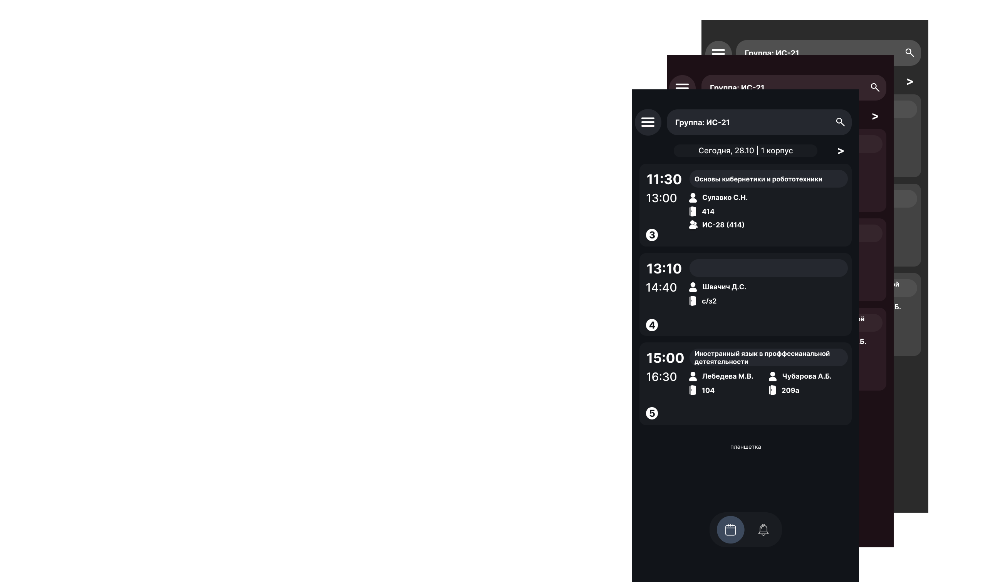
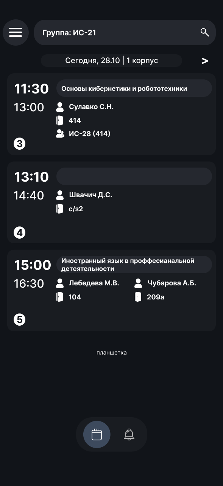
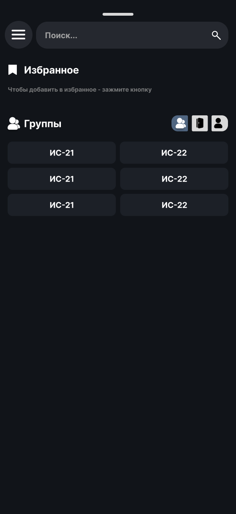
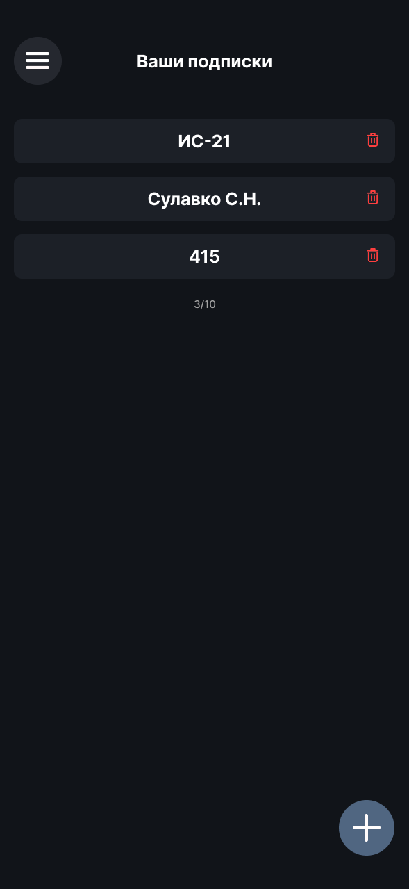
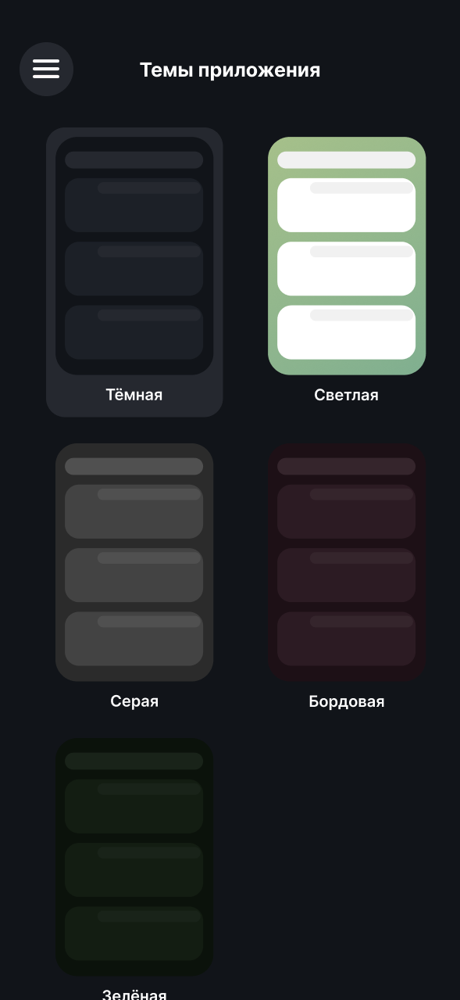
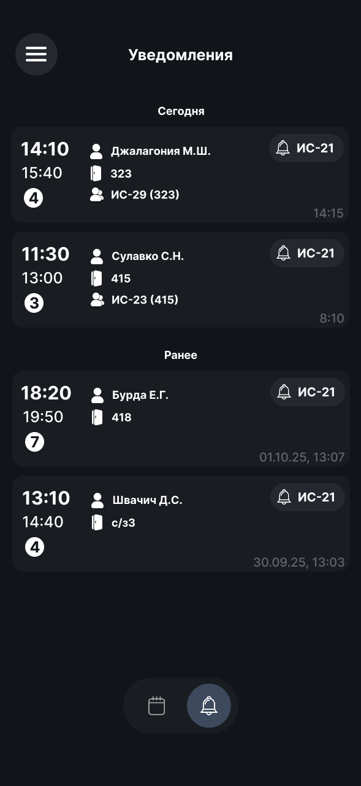

# 📋 РКСИ Планшетка

**Удобное приложение для просмотра расписания с планшетки и сайта РКСИ**

## 📥 Скачать

Выберите удобный для вас способ скачивания:

## 📸 Скриншоты

|    |         |  |
| :-----------------------------------------: | :------------------------------------------------: | :---------------------------------------------: |
|  |  |

## 📜 Задачи

- [x] **База**
  - [x] Дизайн
  - [x] Backend
  - [x] Frontend
- [x] **Основной функционал**
  - [x] Группы, кабинеты, преподаватели
  - [x] Подписки
  - [x] Отображение пар
  - [x] Кеширование
- [x] **Beta-релиз**
  - [x] Уведомления
  - [x] RuStore
  - [x] Автообновление
  - [ ] Темы <-- _вы сейчас тут!_
- [ ] **Финальный релиз**

[GNU AGPL v3 License](./LICENSE) 
**© 2026 RanVix & Yarovich**

